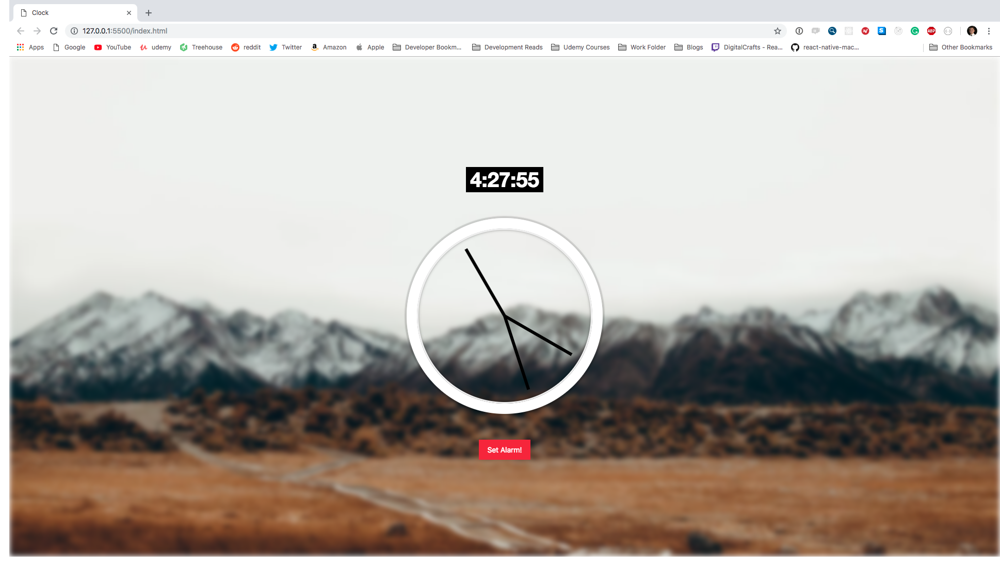

# Web Clock Application

* Built with vanilla javascript
* clock uses the Date method in javascript in order to increment the time
* plan on adding alram clock functionality to the app. 

## Screenshot

